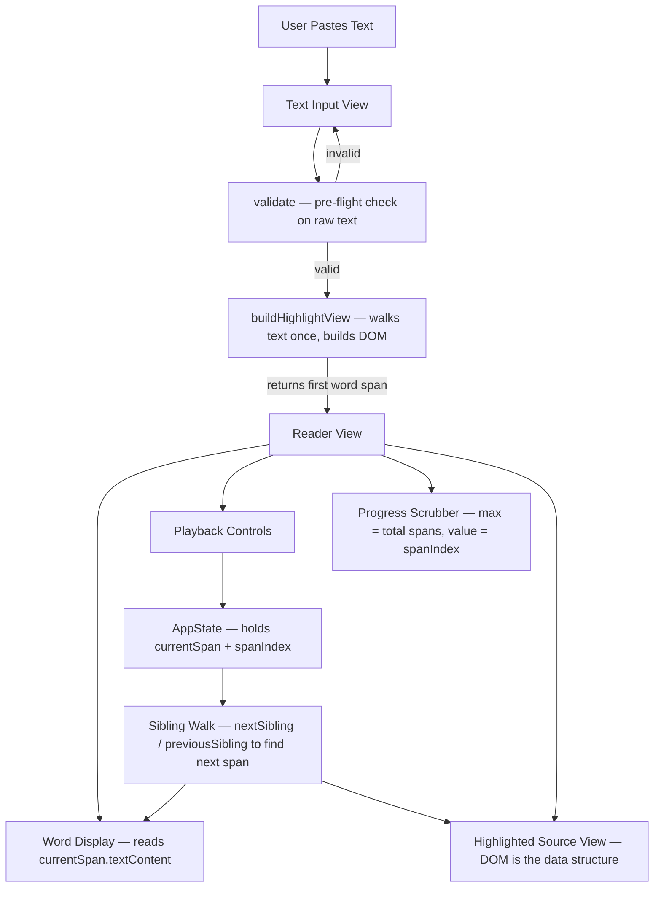
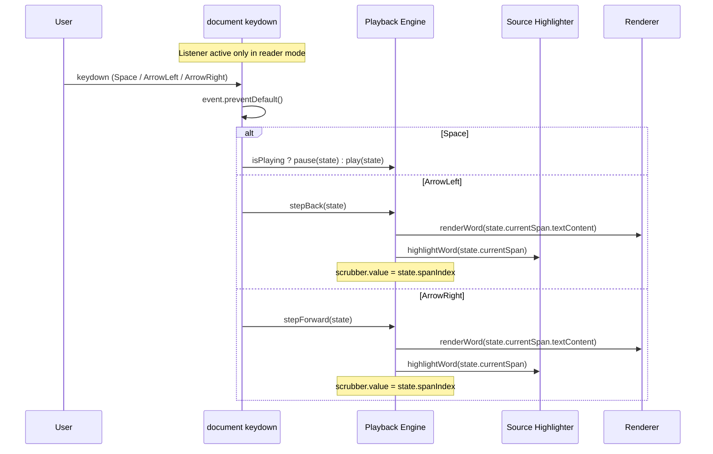

# Design Document: Speed Reader

## Overview

A single-page JavaScript application (no external dependencies) that enables speed reading by displaying one word at a time from a pasted text passage. The user controls playback speed, navigation, and font style while the source text highlights the current word in sync with display.

The app operates in two modes: an input mode where the user pastes text, and a reader mode where words are displayed sequentially with configurable timing and playback controls.

The entire application ships as a single HTML file with embedded CSS and JavaScript.

## Architecture



## Components and Interfaces

### Component 1: AppState

**Purpose**: Central state store for all reader state. Single source of truth.

**Shape**: A plain object with the following properties:
- `currentSpan` — the currently active `<span>` element (the DOM node for the current word)
- `spanIndex` — number, a simple counter incremented/decremented alongside sibling walks; used to keep the scrubber in sync
- `isPlaying` — boolean, playback active flag
- `wpm` — number, words per minute (default 200, range 60–1000)
- `fontFamily` — string, one of `'serif'`, `'sans-serif'`, or `'monospace'`
- `timerId` — number (setTimeout ID) or `null` when no timer is active

**Responsibilities**:
- Hold all mutable application state
- Be the single object mutated by all event handlers
- `currentSpan` is set to the first word span returned by `buildHighlightView` when entering reader mode, then updated on every advance/retreat via sibling walk
- The DOM is the data structure — no parallel arrays or cursor objects needed

---

### Component 2: Word Display

**Purpose**: Renders the current word in large, centered text.

**Functions**:
- `renderWord(word)` — takes a string, updates the focal display element's text content
- `setFont(fontFamily)` — takes a string, applies a font family directly to the display element's `style.fontFamily`

**Responsibilities**:
- `renderWord` updates the focal display element's text content with the current word
- `setFont` applies a font family directly to the display element's `style.fontFamily` — called once when the user changes the font selector, not on every word render

---

### Component 3: Playback Engine

**Purpose**: Drives automatic word advancement using `setTimeout`.

**Functions** (each takes the `state` object):
- `play(state)` — schedules automatic word advancement
- `pause(state)` — clears any pending timer
- `stepForward(state)` — advances one word manually
- `stepBack(state)` — retreats one word manually

**Responsibilities**:
- Schedule next word advancement after `60000 / state.wpm` ms (e.g. 200 WPM → 300ms delay)
- Clear any pending timer on pause or manual navigation
- `stepForward` walks `state.currentSpan.nextSibling` until a `<span>` element is found (skipping text nodes); updates `state.currentSpan` and increments `state.spanIndex`; stops automatically when no next span exists (end of passage)
- `stepBack` walks `state.currentSpan.previousSibling` until a `<span>` element is found; updates `state.currentSpan` and decrements `state.spanIndex`; no-ops when already at the first word span
- Stop automatically at end of passage

---

### Component 4: Progress Scrubber

**Purpose**: A plain `<input type="range">` declared in the static HTML. Its `min` is `0` and `max` is set to the total number of word spans (counted during `buildHighlightView`) minus one, once when entering reader mode. On each word advance or retreat, the playback engine sets `scrubber.value = state.spanIndex` directly — no render function needed.

**Event listener**:
- `onScrubberChange` — wired up once during init; pauses playback and walks the DOM from the first span to find the span at the dragged index, then updates `state.currentSpan` and `state.spanIndex`; immediately calls `scrubber.blur()` after handling the change so the scrubber never retains focus

**Responsibilities**:
- `max` is set once on reader entry: `scrubber.max = totalSpans - 1`
- On each word advance/retreat, the caller does `scrubber.value = state.spanIndex` inline — no function call
- On user drag, `onScrubberChange` pauses playback, jumps to the word span at that index, then calls `scrubber.blur()` to release focus immediately
- The scrubber must never hold focus after interaction — `blur()` is called unconditionally at the end of `onScrubberChange`. This ensures document-level arrow-key events are never captured by the scrubber's native range behaviour

---

### Component 5: Source Highlighter

**Purpose**: Builds the source text display once as individual DOM elements, then walks siblings to highlight the current word — no innerHTML rebuilding on each advance.

**Functions**:
- `buildHighlightView(text)` — takes a string, walks the raw text once, creates a `<span>` for each whitespace-delimited word and text nodes for whitespace/punctuation between words, appends them all to the display `<div>`, and returns a reference to the first word span along with the total span count
- `highlightWord(span)` — takes a span element; removes the `active` CSS class from the previously active span and adds it to the given span, then scrolls it into view

**Responsibilities**:
- `buildHighlightView` is called once when entering reader mode. It walks the raw text and populates the display `<div>` with:
  - A `<span>` element for each whitespace-delimited word
  - Plain text nodes for the whitespace and punctuation runs between words, preserving the original layout
  - Returns the first word span (stored as `AppState.currentSpan`) and the total span count (used to set `scrubber.max`)
- Whitespace and punctuation are kept as text nodes only — they are not wrapped in `<span>` elements, so sibling walks skip them naturally when looking for the next/previous `<span>`
- `highlightWord` removes the `active` class from the previously active span and adds it to the new one, then scrolls it into view
- The display `<div>` uses `white-space: pre-wrap` to preserve original whitespace
- The `active` class drives all highlight styling via CSS — no inline style mutations
- The DOM is the data structure: navigation uses `currentSpan.nextSibling` / `currentSpan.previousSibling` walks, not array indexing

---

### Component 6: Controls Bar

**Purpose**: Renders and wires up all user controls, including keyboard shortcuts active in reader mode.

**Controls**:
- ◀◀ Back one word (button) — also triggered by `ArrowLeft`
- ▶ / ⏸ Play / Pause toggle (button) — also triggered by `Space`
- ▶▶ Forward one word (button) — also triggered by `ArrowRight`
- Speed input: numeric input or slider for WPM (60–1000 WPM)
- Font selector: `<select>` with serif / sans-serif / monospace options — on change, calls `setFont(fontFamily)` to update the display element's CSS directly; does not trigger a word re-render
- Reset button: return to input view

**Keyboard Shortcuts** (active only in reader mode):

A `keydown` listener is attached to `document` when entering reader mode and removed when resetting/exiting reader mode.

| Key | Action |
|-----|--------|
| `Space` | Toggle play / pause |
| `ArrowLeft` | Step back one word |
| `ArrowRight` | Step forward one word |

All three keys call `event.preventDefault()` to suppress native browser behaviour (page scroll, caret movement). The handler is registered on `document`, not on any focusable element, so it fires regardless of which element has focus — including when no element has focus.

**Responsibilities**:
- Register the `keydown` listener on `document` once when entering reader mode
- Remove the `keydown` listener when `reset()` is called or the user exits reader mode
- `Space` calls `state.isPlaying ? pause(state) : play(state)` and updates the play/pause button label
- `ArrowLeft` calls `stepBack(state)`, then syncs the word display, highlight, and scrubber value
- `ArrowRight` calls `stepForward(state)`, then syncs the word display, highlight, and scrubber value

---

## Data Models

### AppState

A plain object with properties:
- `currentSpan` — the currently active `<span>` DOM element (the current word)
- `spanIndex` — number, a simple counter kept in sync with sibling walks; used for the scrubber value
- `rawText` — string
- `isPlaying` — boolean
- `wpm` — number, words per minute (default 200, range 60–1000)
- `fontFamily` — string
- `timerId` — number (setTimeout ID) or `null` when no timer is active

**Speed Conversion**:
- `delayMs = 60000 / wpm`
- 60 WPM → 1000ms (slowest)
- 200 WPM → 300ms (default)
- 1000 WPM → 60ms (fastest)

**Invariant**:
- `currentSpan` always refers to a `<span>` element in the source display `<div>`
- `spanIndex` always equals the zero-based position of `currentSpan` among all word spans in the display `<div>`

---

## Sequence Diagrams

### Start Reading Flow

```mermaid
sequenceDiagram
    participant U as User
    participant UI as Input View
    participant V as Validate
    participant H as Source Highlighter
    participant R as Reader View
    participant E as Playback Engine

    U->>UI: Pastes text, clicks Start
    UI->>V: validate(rawText)
    alt invalid (empty or no words)
        V-->>UI: error object { reason: 'empty' }
        UI->>UI: Show specific error message
    else valid
        V-->>UI: null
        UI->>H: buildHighlightView(rawText)
        H-->>UI: { firstSpan, totalSpans }
        Note over UI: state.currentSpan = firstSpan; state.spanIndex = 0; scrubber.max = totalSpans - 1
        UI->>R: Switch to reader view with state
        R->>E: play(state)
        loop Every 60000/wpm ms
            E->>E: walk nextSibling until <span> found
            Note over E: state.currentSpan = nextSpan; state.spanIndex++
            E->>R: renderWord(state.currentSpan.textContent)
            E->>H: highlightWord(state.currentSpan)
            Note over E: scrubber.value = state.spanIndex
        end
        Note over R: Font is applied separately via setFont() on font selector change
    end
```

### Manual Navigation Flow

```mermaid
sequenceDiagram
    participant U as User
    participant C as Controls
    participant H as Source Highlighter
    participant R as Renderer

    U->>C: Click Back / Forward
    C->>C: walk previousSibling or nextSibling until <span> found
    Note over C: state.currentSpan = found span; decrement or increment state.spanIndex
    C->>R: renderWord(state.currentSpan.textContent)
    C->>H: highlightWord(state.currentSpan)
    Note over C: scrubber.value = state.spanIndex
```

### Keyboard Navigation Flow



---

## Error Handling

### Empty Input

**Condition**: User clicks Start with no text, whitespace-only text, or text containing no valid words  
**Response**: `validate(text)` returns an error object (e.g. `{ reason: 'empty' }`); the UI displays a specific inline validation message and does not switch to reader view  
**Recovery**: User adds valid text and retries

### End of Passage

**Condition**: Playback reaches the last word  
**Response**: Pause automatically, highlight last word, show end indicator  
**Recovery**: User can scrub back or click Reset

### Invalid Speed Value

**Condition**: User enters a non-numeric or out-of-range WPM value  
**Response**: Clamp to valid range (60–1000 WPM), update input to clamped value  
**Recovery**: Automatic — no user action needed

---

## Testing Strategy

### Unit Testing Approach

Key pure functions to unit test:
- `validate(text)` — returns `null` for valid text; returns `{ reason: 'empty' }` for empty string, whitespace-only, and no-words input
- `buildHighlightView(text)` — correct number of `<span>` elements created; text nodes present between spans for whitespace/punctuation; first span returned correctly
- Sibling walk logic — `nextSibling` walk correctly skips text nodes and lands on the next `<span>`; `previousSibling` walk correctly skips text nodes and lands on the previous `<span>`; walk returns `null` at the first/last span
- Speed clamping logic (60–1000 WPM) and `delayMs = 60000 / wpm` conversion

### Property-Based Testing Approach

Since this is a dependency-free vanilla JS project, property-based tests are written manually as loop-driven test cases rather than using a PBT library.

Properties to verify:
- For any non-empty string, `validate` returns `null` iff it contains at least one non-whitespace word; otherwise returns an error object
- For any valid text, the number of `<span>` elements created by `buildHighlightView` equals the number of whitespace-delimited words in the text
- For any valid text, walking all siblings forward from the first span visits every word span exactly once in order
- For any valid text, walking all siblings backward from the last span visits every word span exactly once in reverse order
- `spanIndex` after N forward steps always equals N
- `spanIndex` never goes below 0 or above `totalSpans - 1`

### Integration Testing Approach

- Render the full app in a headless browser (e.g., Playwright)
- Verify that clicking Play advances the displayed word
- Verify scrubber position matches current word index
- Verify highlight scrolls into view
- Verify `Space` keydown toggles play/pause state
- Verify `ArrowLeft` / `ArrowRight` keydown step the word and update the scrubber
- Verify that after dragging the scrubber, `ArrowLeft` / `ArrowRight` keydown still navigate (scrubber does not retain focus)

---

## Performance Considerations

- The source highlighter builds the DOM once on reader entry (`buildHighlightView`). On each word advance, only two class mutations occur (`active` removed from one span, added to the next) — no innerHTML rebuilding, no string concatenation, no full DOM replacement. This eliminates the jank that would otherwise occur for large texts (100k+ characters).
- `setTimeout` drift is acceptable for this use case; `requestAnimationFrame`-based scheduling is not needed.
- For extremely long texts, `buildHighlightView` creates one `<span>` per word up front. This is a one-time cost at mode entry and is negligible for typical passage lengths.

---

## Security Considerations

- `buildHighlightView` populates the source display using DOM text nodes and `textContent` assignments — never `innerHTML`. This means user-pasted text is never interpreted as HTML, eliminating the XSS risk in the source view entirely.
- The word display element also uses `textContent`, not `innerHTML`.

---

## Dependencies

None. Single HTML file with vanilla JavaScript and embedded CSS. No build step required.

---

## Correctness Properties

*A property is a characteristic or behavior that should hold true across all valid executions of a system — essentially, a formal statement about what the system should do. Properties serve as the bridge between human-readable specifications and machine-verifiable correctness guarantees.*

### Property 1: validate() correctness

*For any* string input, `validate` returns `null` if and only if the string contains at least one non-whitespace word; otherwise it returns an error object with a `reason` field.

**Validates: Requirements 1.2, 1.3, 1.4**

---

### Property 2: buildHighlightView span count

*For any* valid text string, the number of `<span>` elements created by `buildHighlightView` equals the number of whitespace-delimited words in that string.

**Validates: Requirements 2.2, 2.4**

---

### Property 3: buildHighlightView round-trip

*For any* valid text string, concatenating the `textContent` of every child node (spans and text nodes) in the source display element after `buildHighlightView` produces a string equal to the original input text.

**Validates: Requirements 2.3**

---

### Property 4: Reader mode initialization invariant

*For any* valid text, immediately after entering reader mode: `AppState.currentSpan` is the first `<span>` in the source display, `AppState.spanIndex` is `0`, and `scrubber.max` equals `totalSpans - 1`.

**Validates: Requirements 3.1, 3.2, 3.3**

---

### Property 5: Delay computation

*For any* WPM value in the range [60, 1000], the computed inter-word delay equals `60000 / wpm` milliseconds.

**Validates: Requirements 4.1, 9.2**

---

### Property 6: Forward sibling walk skips text nodes

*For any* Word_Span that is not the last span in the source display, walking `nextSibling` until a `<span>` is found always lands on a `<span>` element, never on a text node.

**Validates: Requirements 4.2, 5.3**

---

### Property 7: Backward sibling walk skips text nodes

*For any* Word_Span that is not the first span in the source display, walking `previousSibling` until a `<span>` is found always lands on a `<span>` element, never on a text node.

**Validates: Requirements 5.4**

---

### Property 8: Navigation sync invariant

*For any* sequence of `stepForward` and `stepBack` calls, after each call: `AppState.spanIndex` equals the zero-based DOM position of `AppState.currentSpan` among all Word_Spans, the word display shows `AppState.currentSpan.textContent`, the `active` CSS class is on `AppState.currentSpan`, and `scrubber.value` equals `AppState.spanIndex`.

**Validates: Requirements 4.3, 4.4, 4.5, 4.6, 5.6, 13.1, 13.2, 13.3**

---

### Property 9: stepBack boundary — no-op at first word

*For any* valid text, when `stepBack` is called while `AppState.spanIndex` is `0`, `AppState.currentSpan` and `AppState.spanIndex` remain unchanged.

**Validates: Requirements 5.5**

---

### Property 10: Play/pause toggle round-trip

*For any* playback state, toggling play/pause twice (play→pause→play or pause→play→pause) returns `AppState.isPlaying` to its original value.

**Validates: Requirements 6.1**

---

### Property 11: Scrubber seek accuracy

*For any* valid index `i` in `[0, totalSpans - 1]`, after the scrubber is set to `i`, `AppState.spanIndex` equals `i` and `AppState.currentSpan` is the `i`-th Word_Span in the source display.

**Validates: Requirements 7.2**

---

### Property 12: WPM clamping

*For any* numeric WPM input, the value stored in `AppState.wpm` is always within the range [60, 1000] inclusive.

**Validates: Requirements 9.3, 13.4**

---

### Property 13: Font application

*For any* font family string passed to `setFont`, the word display element's `style.fontFamily` equals that string after the call.

**Validates: Requirements 10.2**

---

### Property 14: Highlight class invariant

*For any* word change event, exactly one Word_Span in the source display has the `active` CSS class, and that span is `AppState.currentSpan`.

**Validates: Requirements 11.1, 11.2**

---

### Property 15: Click-to-seek sync invariant

*For any* Word_Span clicked by the user, after the click: `AppState.currentSpan` is that span, `AppState.spanIndex` equals its zero-based DOM position among all Word_Spans, the `active` CSS class is on that span and no other, the word display shows that span's `textContent`, and `scrubber.value` equals `AppState.spanIndex`.

**Validates: Requirements 16.1, 16.2, 16.3, 16.4**
